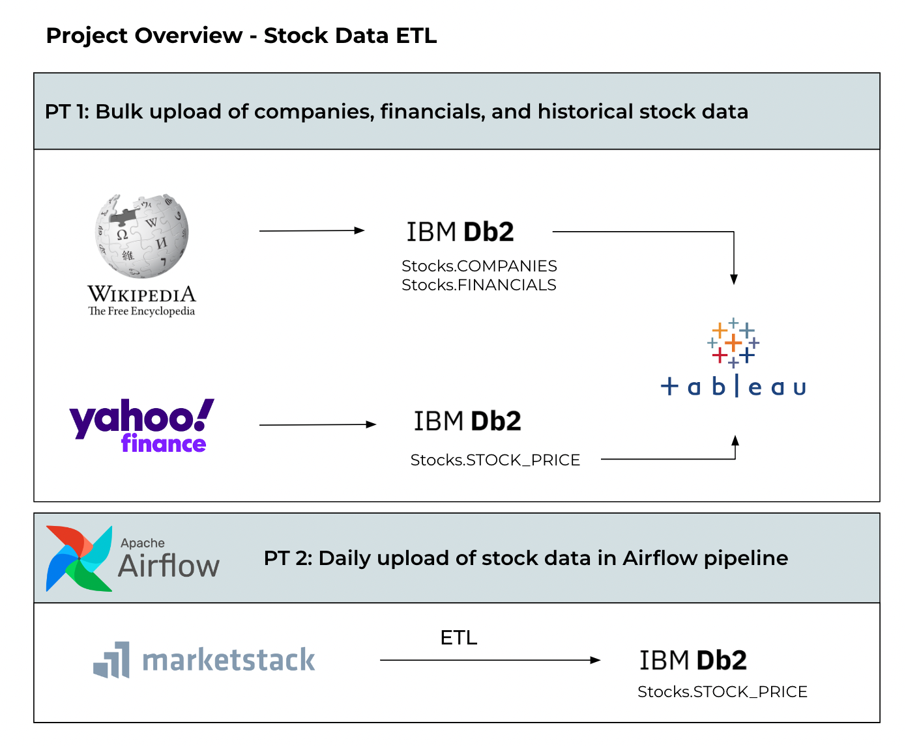
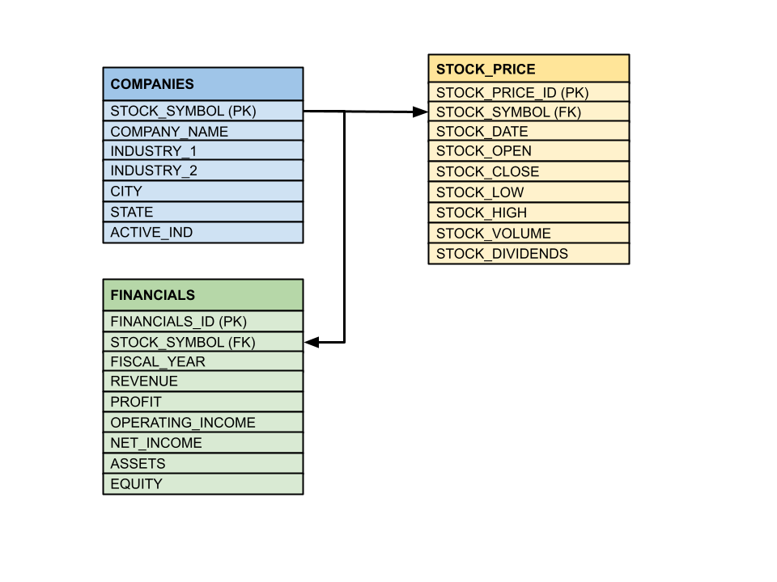
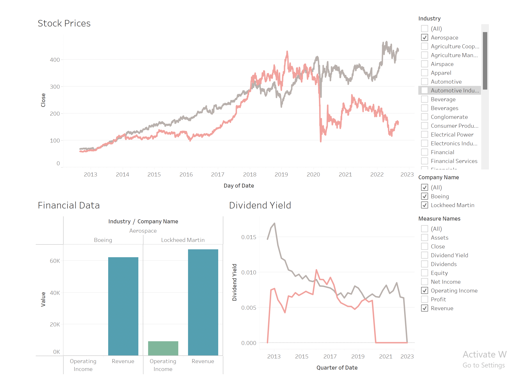

# Stock-Data-ETL

For this project, the goal was to explore data pipelines and how they can be implemented to create value out of raw data. Using multiple sources, relevant stock data was extracted, transformed, and loaded into a database. Basic analytics were done in Tableau with the creation of a side by side company comparison dashboard.

Part 1.1 [Webscraping:](https://github.com/AlexHuntWSU/Stock-Data-ETL/blob/main/ETL_Webscraping.ipynb)

Using the BeautifulSoup package, [data on some of the largest companies](https://en.wikipedia.org/wiki/List_of_largest_companies_in_the_United_States_by_revenue) was extracted and uploaded to a DataFrame. This process involved parsing the html of each company which provided additional information, such as their stock symbol, but also introduced a lot of data cleansing issues.

[Data before cleaning and transformations](https://github.com/AlexHuntWSU/Stock-Data-ETL/blob/main/Webscraped_Data.csv)

[Data after cleansing](https://github.com/AlexHuntWSU/Stock-Data-ETL/blob/main/Cleaned_Data.csv)

[Financial data after transformations](https://github.com/AlexHuntWSU/Stock-Data-ETL/blob/main/Financials.csv)

This data was uploaded to a DB2 database on IBM Cloud. The main reason behind this choice was that I already had an instance created and it provided enough storage for all of the data

[SQL Script](https://github.com/AlexHuntWSU/Stock-Data-ETL/blob/main/Stock_DataTables.sql)

Part 1.2 [Historical Data:](https://github.com/AlexHuntWSU/Stock-Data-ETL/blob/main/Historical_Stock_Data.ipynb)

10 year historical stock data of the companies were uploaded to a DataFrame using the [yfinance](https://github.com/ranaroussi/yfinance) package. This package uses Yahoo's finance API to easily return stock data with no cleansing required. Because of the large amount of data and no bulk upload feature, this data had to be manually loaded on IBM cloud.

This data was used to create the Tableau dashboard below. The primary purpose of the dashboard was to provide a quick comparison of companies within a specfic industry. 

Part 2 [Airflow DAG:](https://github.com/AlexHuntWSU/Stock-Data-ETL/blob/main/Airflow_Stock_Data_ETL.py)

Airflow was used to manage the scheduled ETL part of the project. Everyday at 8pm, the DAG is scheduled to upload the end-of-day stock data for all active companies to the database. The marketstack API was used instead of yfinance due to it being an actual API that uses access keys and returns JSON data. This provided more complexity to the project as well as experience with APIs. 

